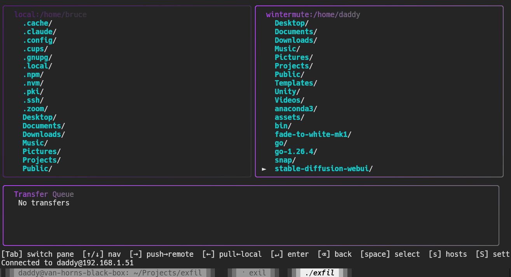

# exfil — cyberpunk TUI SCP/SFTP client

[](https://github.com/brucevanhorn2/exfil/actions/workflows/ci.yml)
[](LICENSE)



A terminal-based file transfer client for Linux (Ubuntu/Pop_OS) built with Go, Bubbletea, and Lipgloss.

**📖 Documentation:**
- **User guide** — This README
- **[Developer/Agent guide](AGENT_GUIDE.md)** — Architecture, concurrency model, how to contribute
- **[Implementation notes](CLAUDE.md)** — Detailed status, code patterns, critical path
- **[GitHub issues](https://github.com/brucevanhorn2/exfil/issues)** — Roadmap and task tracking

## Status

Dual-pane local **and remote (SFTP)** file browsing, with a live transfer queue, progress bars, and host management — all working end-to-end.

- ✅ Dual-pane file browser (local ↔ remote over SFTP)
- ✅ SSH/SFTP connection via the Site Manager (`s` to open, saved hosts in `hosts.yaml`)
- ✅ Add/edit hosts from within the app (`n`/`e` in the Site Manager)
- ✅ Transfer queue pane with progress bars, capped height so it never pushes the layout off-screen
- ✅ File navigation (↑/↓/Enter/Backspace), selection (Space, shows a persistent checkbox)
- ✅ Directional transfers: **→** pushes local→remote, **←** pulls remote→local, regardless of pane focus
- ✅ Concurrent transfer worker pool (3 workers, bounded concurrency)
- ✅ Live progress reporting with speed calculation
- ✅ Cyberpunk theming (dark, magenta/cyan/green accents), panes fill the full terminal
- ✅ About screen (`?`) — logo, version, license
- ✅ Selectable lingo packs (plain/secretsquirrel/keyboardcowboy/corposlut) and free-form hex theme colors via the Settings screen (`S`)
- ✅ Gradient/neon chrome: pane borders, titles, and the transfer progress bar all render as a color gradient between your chosen primary/secondary theme colors, instead of a flat color
- ⏳ Directory copy support
- ⏳ Delete/rename/mkdir operations
- ⏳ Multi-host sessions (currently one SSH connection at a time)

## Building

```bash
cd /home/bruce/Projects/exfil
make build
```

This embeds a version string from `git describe` (shown on the About screen). A plain `go build -o exfil ./cmd/exfil` also works but leaves the version as `dev`.

## Running

```bash
./exfil
```

Controls:
- **Tab** — switch focus between panes
- **↑/↓** — navigate within pane
- **Enter** — enter directory
- **Backspace** — go back to parent directory
- **Space** — toggle select file
- **→** — push selected file(s) from local to remote
- **←** — pull selected file(s) from remote to local
- **s** — open the Site Manager (connect to a saved host; `n` to add, `e` to edit)
- **S** — Settings (lingo pack, theme colors)
- **?** — about screen
- **q** — quit

## Architecture

### Concurrency model

Two patterns:

1. **One-shot async work** (directory listing): Plain `tea.Cmd` run in a goroutine by Bubbletea, result delivered as a message.
2. **Continuous streams** (transfer progress): Channel + re-arming `tea.Cmd` ("subscription" pattern):
   - `eventsCh` collects progress from worker goroutines
   - N=3 worker goroutines pull jobs from `jobsCh` and stream progress back
   - `Update` loop receives messages single-threaded, updates transfer state
   - No mutexes — strict CSP discipline ("share nothing, communicate everything")

### Package layout

- `cmd/exfil/main.go` — Entry point, starts worker pool
- `internal/config/` — Site manager persistence (hosts.yaml)
- `internal/sshclient/` — SSH/SFTP dial (agent auth + identity fallback)
- `internal/fsys/` — Filesystem abstraction (LocalFS, RemoteFS)
- `internal/transfer/` — Copy engine, worker pool, progress tracking
- `internal/ui/` — Bubbletea TUI (panes, theme, app model)

### File system abstraction

`fsys.FileSystem` interface allows both panes to reuse the same navigation and rendering code:
```go
type FileSystem interface {
    ReadDir(path string) ([]Entry, error)
    Join(elem ...string) string
    Home() (string, error)
    Open(path string) (io.ReadCloser, error)
    Create(path string) (io.WriteCloser, error)
    Stat(path string) (*Entry, error)
}
```

`LocalFS` uses `os.ReadDir`, `filepath.Join`, etc. `RemoteFS` wraps an `*sftp.Client` using SFTP protocol calls.

## Host management

Hosts are stored in `~/.config/exfil/hosts.yaml` (YAML, supports comments). You can edit it by hand, or manage it entirely from within the app:

- **s** — open the Site Manager
- **n** — add a new host (Tab/Shift+Tab between fields, Enter to save)
- **e** — edit the selected host
- **Enter** — connect to the selected host

`sshclient.Dial` authenticates via ssh-agent first, then falls back to `~/.ssh/id_ed25519`, `id_rsa`, `id_ecdsa` in that order. No password/passphrase prompts.

## Testing locally

Without a connection, the remote pane is empty (a "press `s` to select a host" message) so it's never mistaken for a live remote host. Pass `-t` to instead browse the local filesystem (rooted at `/`) in both panes, so you can test transfers without SSH:

```bash
mkdir -p /tmp/exfil-test/{a,b}
echo "test content" > /tmp/exfil-test/a/file1.txt
./exfil -t
# In the app, navigate the local (left) pane to /tmp/exfil-test/a
# Navigate the remote (right) pane to /tmp/exfil-test/b
# Select file1.txt in the left pane, press '→' to copy it to the right
```

## Known limitations

- Directories cannot be copied (shows "not supported" message)
- Single SSH connection per session (no switching between hosts mid-run)
- No delete, rename, mkdir, or view/edit operations
- No 1Password integration
- No recursive directory sync
- Destination pane listing doesn't auto-refresh after a transfer completes (navigate away and back to see the new file)

## Logs

Application logs go to `/tmp/exfil.log` for debugging.
